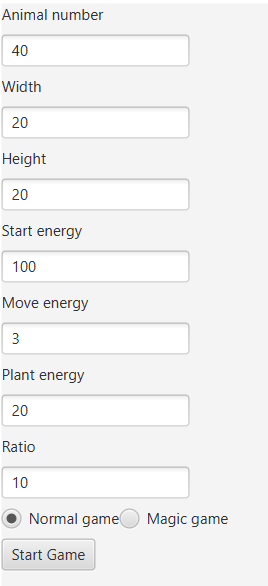
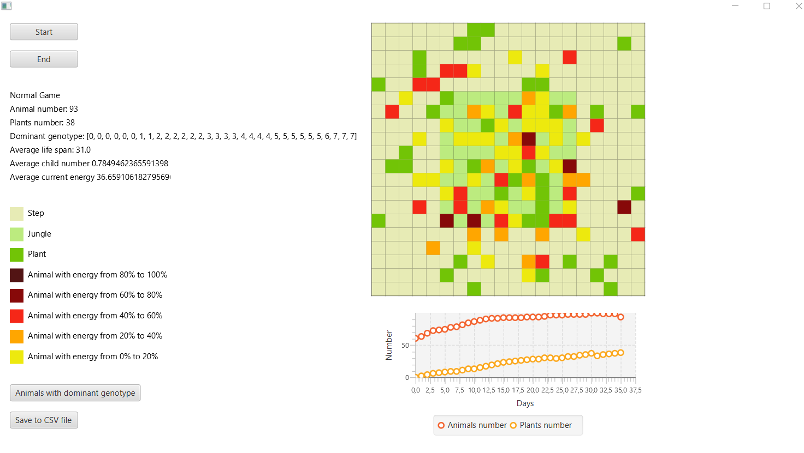
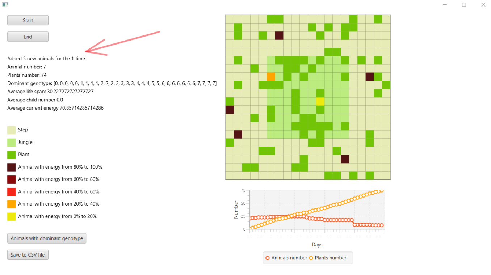
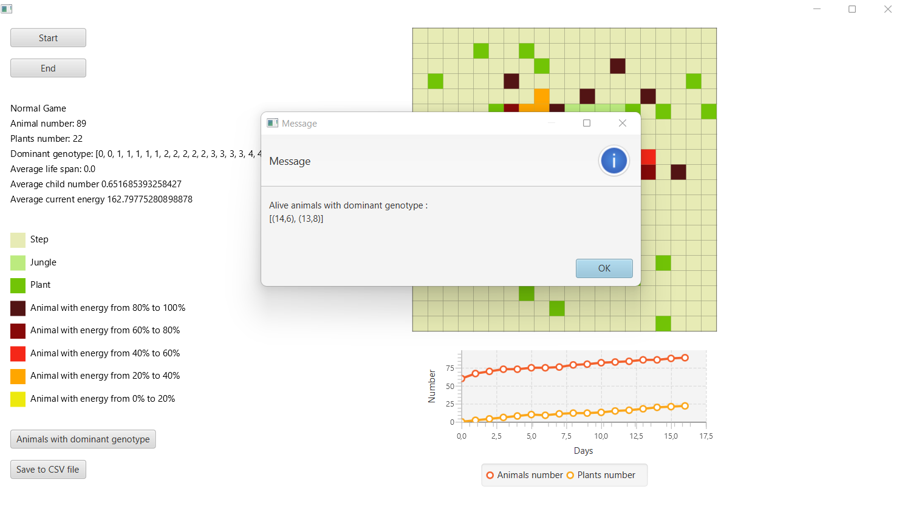
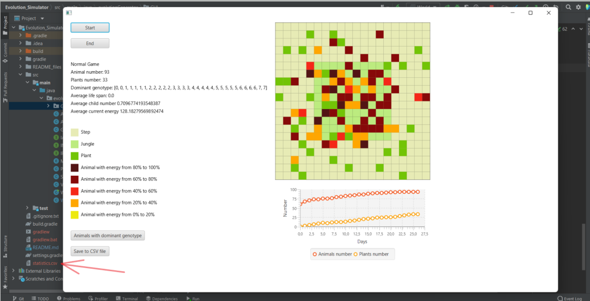

# Evolution_Simulator
### Simple simulator made for Object Oriented Programming course (PO) at AGH 2021/22.

### Technologies used:
* Java
* JavaFX

### Introduction
This simulator is based on simple Darwin's Theory - only strongest organisms can survive. Every day animals move, eat and reproduce. When they run out of energy they die. Every animal has genetype and his own energy level. 

The colourful squares symbolize animals and plants according to the legend.

<video loop width=900px>
    <source src="README_files/simulation_film.mp4">
</video>

### Before simulation
Simulation takes place on the step-map with small jungle in the middle. 
Before simulation user can choose his own options: size of the step and jungle, start number of animals and plants, the amount of energy the animals get at the beginning, the amount of energy the animals lose after move and the amount of energy the animals get after eating a plant.

### Simulation
Simulation continues until all animals die and the entire map is filled with plants. 
Every day:
* all dead animals are removed from the map (animal dies when his energy is equal or smaller than 0)
* every animal change his direction (it cost them energy)
* animals in the field with the plant eat it and gain energy (plant energy must must be shared among all the animals in the field)
* if there are at least 2 animals (if more, the strongest 2 are chosen) in the field and they have at least 50% of start energy, they can breed. Child inherits the geneotype and gets 25% of the energy of each parent.
* two plants appear on the map - one in the step and one in the jungle
* all statistics are updated

### Options
Simulation can be stopped/restarted/ended at any time.  
User can change type of the game - normal or magic. Three times during the magic game when the number of animals is less than 10, a new 5 animals will appear on the map. Normal game doesn't have this option. 

### Statistics
Statistics are updated every day of simulation.  
You can track:
* number of plants and animals
* dominant (the most common) genotype
* average life span, child number and curreny energy 

In addition, a graph is drawn showing the number of animals and plants

### Animals with dominant genotype
After clicking on "Animals with dominant genotype" button, information will appear with the coordinates of the fields on which, all alive animals with dominant genotype, are located. The coordinates are calculated in the same way as in the first quadrant of the coordinate system

### Save to CSV file
After clicking on "Save to CSV file" all statistics will be saved to CSV file.

